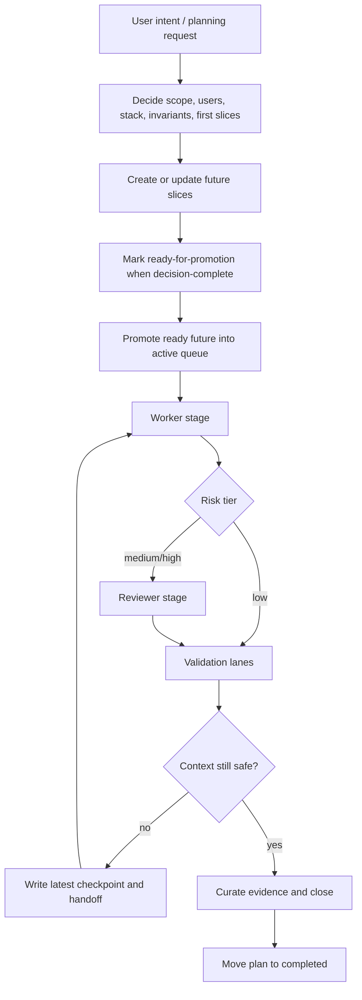

# Agent Orchestration Harness

Status: canonical
Owner: Platform Engineering
Last Updated: 2026-03-17
Source of Truth: This directory.

Reusable harness for bootstrapping agent-first repositories.

## What This Repo Is

- This repository is the harness source.
- `template/` is the downstream example and install payload.
- `scripts/harness-sync.mjs` installs, updates, and drift-checks that payload in downstream repos.
- `template/README.md` becomes the downstream repo's root README after bootstrap.

## Intended Behavior

Use the template docs as the example of how the harness is meant to behave after bootstrap.
Use this root README as the visible pre-bootstrap entrypoint for how to start a new repo from the template.

Start here:

- [template/docs/ops/automation/LITE_QUICKSTART.md](template/docs/ops/automation/LITE_QUICKSTART.md)
- [template/AGENTS.md](template/AGENTS.md)
- [template/docs/PLANS.md](template/docs/PLANS.md)
- [template/README.md](template/README.md)

The intended loop is:

1. plan futures
2. make them decision-complete
3. orchestrate and run them in sequence
4. preserve clean checkpoint and handoff continuity between fresh agents

One future file equals one executable slice. The queue stays flat: `future -> active -> completed`.
Completed slices are committed atomically before the queue moves on.

## Planning Before Bootstrap

Use this repository before any template files are copied into a target repo.

1. Start in plan mode and do not edit implementation files yet.
2. Decide and log what the app does, who it serves, which stack/runtime/tooling it uses, and which invariants are non-negotiable.
3. Propose the first concrete execution slices and acceptance criteria.
4. Decide which items should become future slices versus tiny direct active work after bootstrap.
5. Approve the planning output before running install/bootstrap.

The planning goal is not a vague brainstorm. It is a decision-complete backlog the harness can execute later with minimal token waste.

## Orchestration Flow



## Bootstrap

Preferred path:

1. Run `node ./scripts/harness-sync.mjs install --target /path/to/target-repo`.
2. Replace placeholders from [template/PLACEHOLDERS.md](template/PLACEHOLDERS.md).
3. Merge the scripts from [template/package.scripts.fragment.json](template/package.scripts.fragment.json) into the downstream `package.json`, then keep the real `package.json` aligned with the fragment.
4. Run `npm run harness:verify` in the downstream repo so the actual `package.json` operator entrypoints are checked.
5. Seed futures in `docs/future/` and any tiny direct work in `docs/exec-plans/active/`.
6. Run `./scripts/check-template-placeholders.sh`.
7. Run `./scripts/bootstrap-verify.sh`.

Bootstrap check scripts shipped by the template:

- [template/scripts/check-template-placeholders.sh](template/scripts/check-template-placeholders.sh)
- [template/scripts/bootstrap-verify.sh](template/scripts/bootstrap-verify.sh)

After install, those run from the target repo root as `./scripts/check-template-placeholders.sh` and `./scripts/bootstrap-verify.sh`.

Other harness sync commands:

- install: `node ./scripts/harness-sync.mjs install --target /path/to/repo`
- update: `node ./scripts/harness-sync.mjs update --target /path/to/repo`
- drift: `node ./scripts/harness-sync.mjs drift --target /path/to/repo`

## Agent Quickstart

Planning kickoff:

```text
We are starting a new app from this repository template.
Stay in plan mode and do not edit implementation files yet.
Help me decide and log:
1. what the app does and who it serves,
2. which stack/runtime/tooling we will use,
3. core invariants and non-negotiables,
4. first concrete execution slices and acceptance criteria,
5. which items should become future slices after bootstrap.
When you propose execution slices, default to one executable future file per slice.
Use Dependencies when work spans multiple slices.
Call out any item that is tiny enough for direct active work instead of a future.
Output a decision-complete backlog I can approve before bootstrap.
```

Execution handoff:

```text
Approved. Bootstrap and execute the harness workflow now:
1. install the harness into the target repo,
2. replace placeholders,
3. wire the required package scripts,
4. keep futures in docs/future and tiny direct work in docs/exec-plans/active,
5. run ./scripts/check-template-placeholders.sh and ./scripts/bootstrap-verify.sh,
6. grind ready futures with automation:run, automation:resume, or automation:grind,
7. keep checkpoints, handoffs, validation, atomic commits, and Done-Evidence current.
```

## Root Commands

This repo itself exposes only:

- `npm run test:root`
- `npm run test:template-smoke`
- `npm test`

## README Lifecycle

- This root `README.md` explains the harness source repo.
- `template/README.md` is the README that downstream adopted repositories inherit.
