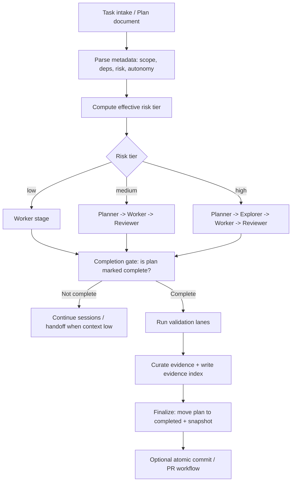

# Agent Orchestration Harness

Status: canonical
Owner: Platform Engineering
Last Updated: 2026-03-04
Source of Truth: This directory.

Reusable harness for initializing agent-first repositories with docs-as-governance, blast-radius control, and evidence-based delivery.

## What This Does

- Provides a production-oriented harness for agent-driven software delivery.
- Ships a docs-as-system-of-record structure with enforceable governance and architecture rules.
- Adds optional orchestration, role-specialized execution (`planner`, `explorer`, `worker`, `reviewer`), safety gates, and verification automation.

## What We Are Trying To Achieve

- Replace ad-hoc coding sessions with repeatable, auditable, high-quality execution.
- Keep agent velocity high without sacrificing correctness, safety, or maintainability.
- Make execution quality demonstrable through policy checks, evidence trails, and metrics.

## Benefits

- Faster delivery loops via `verify:fast` + compact runtime context.
- Stronger reliability via `verify:full`, risk-tier routing, and approval gates.
- Session continuity by design: proactive context rollover + structured handoffs between isolated runs.
- Reduced content rot: canonical docs stay aligned with behavior through required checks and policy manifests.
- Better handoff and team alignment via canonical docs, plan metadata, and evidence indexes.
- Clearer operational posture: practical structure for correctness and rollback instead of prompt improvisation.

## Adoption Lanes

Use the least process that still protects correctness.

1. `Lite`: manual plan loop (`active -> completed`) + `verify:fast` / `verify:full`.
2. `Guarded`: orchestrator sequential execution with risk/approval gates.
3. `Conveyor`: parallel/worktree execution with branch/PR automation.

## Agent Pickup Without Pollution

Feature agents should consume derived, task-scoped surfaces, not improvise from the entire repo.

- Keep canonical policy in `AGENTS.md`, architecture docs, governance docs, and plan/evidence files.
- Compile runtime instructions into `docs/generated/agent-runtime-context.md` for compact shared policy.
- Generate task-scoped contact packs from plan state, checkpoints, and evidence for each role session.
- Export platform-native agent scaffolds only as derived artifacts such as `.github/agents/*`; do not make them the source of truth.
- Treat `docs/generated/*`, `.github/agents/*`, and `docs/ops/automation/runtime/*` as generated or transient surfaces that can be rebuilt from canonical docs and run state.

## Mermaid Diagram Of Orchestration Flow



## Session Safety and Context Continuity

- Default memory posture is repo-local: treat the repo as the operating system, keep plans/evidence/docs/code/validation as source of truth, and widen scope only when a blocker requires it.
- Sessions follow context guardrails: `contextSoftUsedRatio` is the point to stop widening scope, while `contextHardUsedRatio` and `contextAbsoluteFloor` force safe same-role rollover/handoff.
- Every session must write a structured result payload (`ORCH_RESULT_PATH`) including numeric `contextRemaining`.
- Non-terminal sessions must also emit structured continuity fields (`currentSubtask`, `nextAction`, `stateDelta`) so orchestration can checkpoint resumable machine state instead of relying on raw transcript history.
- Continuity is persisted as repo-local runtime state under `docs/ops/automation/runtime/state/<plan-id>/latest.json` and `checkpoints.jsonl`.
- Handoffs are written as both markdown notes and structured JSON packets, then reused by later same-run rollovers and `resume` runs.
- Runtime context is recompiled from canonical docs (`docs/generated/agent-runtime-context.md`) to reduce drift and hallucination risk.
- Contact packs now carry runtime policy, the memory posture, task scope, latest continuity state, selected checkpoints, and capped evidence references.
- Improve checkpoint contents, contact-pack selection, evidence compaction, and observability before considering external retrieval or off-repo memory.
- Repo-local checkpoints and contact packs remain the default memory architecture; see `template/docs/agent-hardening/MEMORY_CONTEXT.md` for the detailed rule set and escalation triggers.

## Operating Model

- Governance as working manual:
  - `AGENTS.md`, architecture docs, and governance rules define constraints and expectations.
  - The repository itself is the operating manual for humans and agents.
- Role-specialized execution:
  - Risk-adaptive role routing runs focused stages (`planner`, `explorer`, `worker`, `reviewer`) instead of one generic agent loop.
  - Each role runs in an isolated session with explicit handoff metadata.
- Two execution paths:
  - Fast manual path for short tasks and direct coding loops at inference speed.
  - Futures path for larger work: define in `docs/future`, promote to active plans, optionally execute with orchestration, and complete with closure/evidence.
- Evidence-first delivery:
  - Non-trivial work leaves clear metadata, validation traces, and done-evidence references.
  - Team members can inspect progress, decisions, and status directly in-repo.
  - Plans separate current facts, executable scope, and deferred target state so completion cannot silently collapse into partial delivery.

## Daily Workflow

1. Start in plan mode and lock decisions: app scope, stack/runtime/tooling, invariants, and first acceptance slices.
2. Define futures and active plans: strategic work goes through `future -> active -> completed`; quick/manual work can run `active -> completed`.
   Every non-trivial plan should separate `## Already-True Baseline`, `## Must-Land Checklist`, and `## Deferred Follow-Ons`.
3. Execute and close: run manual or orchestrated loops, use `verify:fast` during implementation, run `verify:full` before completion/merge, and keep docs plus `Done-Evidence` current.

## Why This Model Works

- It keeps inference-speed execution while staying structured.
- It supports both rapid delivery and strategic multi-plan execution.
- It is team-grade: auditable, reviewable, and handoff-ready by default.

## Common Command Matrix

| Command | Use When |
| --- | --- |
| `npm run plans:verify` | You want a fast plan-state check only. |
| `npm run verify:fast` | You want standard local preflight before grind/resume/commit. |
| `npm run verify:full` | You are preparing merge-level validation. |
| `npm run automation:run:grind` | You want supervised low-risk grind until queue is stable/drained. |
| `npm run automation:run:grind:medium` | Same as above, but allow medium risk plans too. |
| `npm run automation:run:grind:high` | Same as above, but allow medium+high risk plans too. |
| `npm run automation:resume:grind` | Continue the last run in supervised loop mode. |
| `npm run automation:resume:high:non-atomic` | Run one direct medium+high non-atomic continuation when the worktree must stay dirty. |
| `npm run automation:audit` | Inspect blocked/failed/pending plans and suggested next steps. |

Future blueprint promotion rule:
- Before setting `Status: ready-for-promotion`, add `## Master Plan Coverage` or `## Capability Coverage Matrix`, add `## Prior Completed Plan Reconciliation`, add `## Promotion Blockers`, and run `npm run plans:verify`.

For full command contracts, flags, and policy behavior, use `template/docs/ops/automation/README.md`.

Canonical policy and lifecycle docs:
- `template/docs/ops/automation/LITE_QUICKSTART.md`
- `template/docs/ops/automation/OUTCOMES.md`
- `template/docs/ops/automation/INTEROP_GITHUB.md`
- `template/docs/ops/automation/PROVIDER_COMPATIBILITY.md`
- `template/docs/governance/rules.md`
- `template/docs/governance/policy-manifest.json`
- `template/docs/PLANS.md`
- `template/PLACEHOLDERS.md`

## Bootstrap Steps

1. Copy `template/` contents into a new repository root.
2. Replace placeholders from `PLACEHOLDERS.md`.
3. Add the required scripts from `template/package.scripts.fragment.json` to `package.json`.
4. Run `./scripts/check-template-placeholders.sh`.
5. Run `./scripts/bootstrap-verify.sh`.

## Agent Quickstart (Plan Mode)

Use this before copying `template/` into a new repository. At this stage, the root repository is the template entrypoint the agent can actually see.

1. Start the agent in plan mode from this repository before any file edits.
2. Lock product scope, users, stack/runtime/tooling, core invariants, first slices, and acceptance criteria.
3. Approve the plan before copying files into the target repository.
4. After approval, execute bootstrap: copy `template/` into the new repository root, replace placeholders, wire scripts, seed plans, and run the bootstrap checks.
5. Once bootstrapped, rely on the adopted repository's `README.md`, `AGENTS.md`, and `docs/*` as the new canonical operating surface.

Prompt 1 (planning kickoff, before any file copy):

```text
We are starting a new app from this repository template.
Stay in plan mode and do not edit files yet.
Help me decide and lock:
1) what the app does and who it serves,
2) which stack/runtime/tooling we will use,
3) core invariants and non-negotiables,
4) first implementation slices and acceptance criteria,
5) initial futures backlog with dependencies/risk tiers.
Output a decision-complete implementation plan I can approve.
```

Prompt 2 (bootstrap + execution handoff, after planning approval):

```text
Approved. Execute bootstrap now:
1) copy template files into repository root,
2) replace placeholders from PLACEHOLDERS.md,
3) wire required package scripts,
4) seed strategic plans in docs/future and quick fixes in docs/exec-plans/active as appropriate,
5) run ./scripts/check-template-placeholders.sh,
6) run ./scripts/bootstrap-verify.sh.
Then start execution using automation:run (or automation:run:parallel when dependencies allow).
Keep docs, metadata, and Done-Evidence updated as work progresses.
```

Detailed adopter guidance remains in `template/README.md`.
