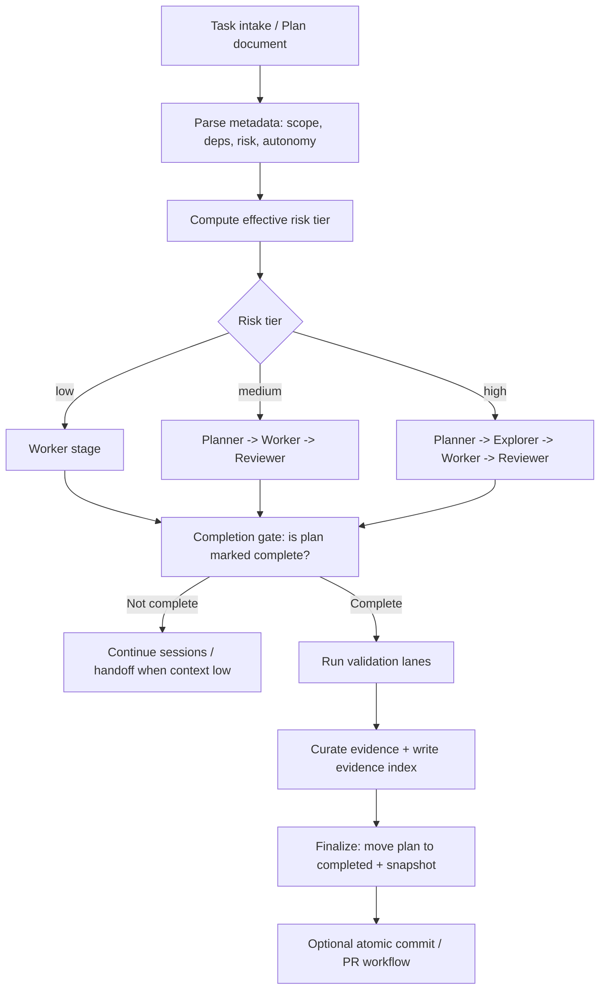

# {{PRODUCT}}

Status: canonical
Owner: {{DOC_OWNER}}
Last Updated: {{LAST_UPDATED_ISO_DATE}}
Source of Truth: This document delegates to linked canonical docs.
Current State Date: {{CURRENT_STATE_DATE}}

{{SUMMARY}}

This file is intended to become the adopted repository's root `README.md` after bootstrap.

## Operating Model

- Docs-first minimal: repository-local docs are the system of record.
- `AGENTS.md` is the concise map for humans and agents.
- Humans define priorities and constraints; agents execute scoped changes.
- Documentation and verification checks are required before merge.

## Adoption Lanes

Use the least ceremony required for the risk profile:

1. `Lite`: manual plan loop (`active -> completed`) with `verify:fast` and `verify:full`.
2. `Guarded`: sequential orchestration with risk routing and approval gates.
3. `Conveyor`: parallel/worktree orchestration with optional branch/PR automation.

## Mermaid Diagram Of Orchestration Flow

## Lite Quickstart

Start with the lowest-overhead path first:

1. Track work in `docs/exec-plans/active/`.
2. Implement one focused slice.
3. Run `npm run verify:fast` while iterating.
4. Run `npm run verify:full` before completion/merge.
5. Move plan to `docs/exec-plans/completed/` with canonical `Done-Evidence`.
6. Keep executable scope explicit with `## Already-True Baseline`, `## Must-Land Checklist`, and `## Deferred Follow-Ons`.

Reference: `docs/ops/automation/LITE_QUICKSTART.md`.

## Execution Paths

- Default path for non-trivial changes: use orchestration (`automation:run` / `automation:resume`) to drive plan promotion and execution.
- Manual path: allowed for interactive work using the same metadata and evidence/index rules, with dual-track lifecycle (`future -> active -> completed` for strategic work, `active -> completed` for quick/manual fixes).
- Lifecycle and policy details remain canonical in `docs/PLANS.md`, `docs/exec-plans/README.md`, and `docs/ops/automation/README.md`.

## Session Safety and Context Continuity

- Default memory posture is repo-local: treat the repo as the operating system, keep plans/evidence/docs/code/validation as source of truth, and widen scope only when a blocker requires it.
- Sessions follow context guardrails: `contextSoftUsedRatio` is the point to stop widening scope, while `contextHardUsedRatio` and `contextAbsoluteFloor` force safe same-role rollover/handoff.
- Every session must write a structured result payload (`ORCH_RESULT_PATH`) including numeric `contextRemaining`.
- Non-terminal sessions must also emit structured continuity fields (`currentSubtask`, `nextAction`, `stateDelta`) so orchestration can checkpoint resumable machine state instead of relying on raw transcript history.
- Continuity is persisted as repo-local runtime state under `docs/ops/automation/runtime/state/<plan-id>/latest.json` and `checkpoints.jsonl`.
- Handoffs are written as both markdown notes and structured JSON packets, then reused by later same-run rollovers and `resume` runs.
- Runtime context is recompiled from canonical docs (`docs/generated/AGENT-RUNTIME-CONTEXT.md`) to reduce drift and hallucination risk.
- Contact packs now carry runtime policy, the memory posture, task scope, latest continuity state, selected checkpoints, and capped evidence references.
- Improve checkpoint contents, contact-pack selection, evidence compaction, and observability before considering external retrieval or off-repo memory.
- Repo-local checkpoints and contact packs remain the default memory architecture; see `docs/agent-hardening/MEMORY_CONTEXT.md` for the detailed rule set and escalation triggers.

## Documentation Navigation

Start with:
- `AGENTS.md`
- `ARCHITECTURE.md`
- `docs/MANIFEST.md`
- `docs/README.md`
- `docs/PLANS.md`
- `docs/FRONTEND.md`
- `docs/BACKEND.md`
- `docs/agent-hardening/README.md`
- `docs/governance/README.md`
- `docs/product-specs/README.md`
- `docs/product-specs/CURRENT-STATE.md`
- `docs/exec-plans/README.md`
- `docs/ops/automation/README.md`

## Platform Scope Snapshot

- {{SCOPE1}}
- {{SCOPE2}}
- {{SCOPE3}}
- Detailed current behavior is tracked in `docs/product-specs/CURRENT-STATE.md`.

## Architecture At A Glance

- Frontend/runtime stack: {{FRONTEND_STACK}}
- Backend/runtime stack: {{BACKEND_STACK}}
- Data/storage stack: {{DATA_STACK}}
- Shared contracts/primitives strategy: {{SHARED_CONTRACT_STRATEGY}}
- Frontend standards: `docs/FRONTEND.md`
- Backend standards: `docs/BACKEND.md`

## Documentation Layering

- `AGENTS.md`: concise operating map and non-negotiables.
- `README.md`: product-level snapshot and entrypoints.
- `ARCHITECTURE.md` + `docs/architecture/*`: architecture source of truth.
- `docs/FRONTEND.md` and `docs/BACKEND.md`: implementation-side standards.

## Enforcement and Quality Gates

- Runtime context build: `npm run context:compile`
- Governance checks: `npm run docs:verify`, `npm run conformance:verify`, `npm run architecture:verify`, `npm run agent:verify`, `npm run eval:verify`, `npm run plans:verify`, `npm run harness:verify`
- Plan metadata drift self-heal (local default): `plans:verify` auto-aligns top-level `Status:` with metadata `- Status`; disable via `ORCH_PLAN_METADATA_AUTO_HEAL_STATUS=0` (CI defaults to disabled).
- Broad future-native parents that still need decomposition should use `npm run plans:scaffold-children -- --plan-file <path>` instead of staying childless; legacy heading parents should use `npm run plans:migrate -- --plan-file <path>` first.
- Fast iteration profile: `npm run verify:fast`
- Full merge profile: `npm run verify:full`
- Canonical command map and policy: `docs/governance/RULES.md`

## When To Run Checks

- During implementation loops: `npm run verify:fast`.
- Before merge: `npm run verify:full`.
- Capture baseline and post-change metrics: `npm run perf:baseline`, `npm run perf:after`.

## Automation Conveyor Commands

- Start run (guarded, low-only baseline, clean + atomic defaults): `npm run automation:run`
- Start run with medium enabled: `npm run automation:run:medium`
- Start run with medium+high enabled: `npm run automation:run:high`
- Start supervised run loop (auto `run` + repeated `resume` until drained/stable): `npm run automation:run:grind`
- Start supervised run loop with medium enabled: `npm run automation:run:grind:medium`
- Start supervised run loop with medium+high enabled: `npm run automation:run:grind:high`
- Start parallel run (same baseline, anchored to current branch): `npm run automation:run:parallel`
- Start parallel run with medium enabled: `npm run automation:run:parallel:medium`
- Start parallel run with medium+high enabled: `npm run automation:run:parallel:high`
- Start supervised parallel run loop: `npm run automation:run:parallel:grind`
- Start supervised parallel run loop with medium enabled: `npm run automation:run:parallel:grind:medium`
- Start supervised parallel run loop with medium+high enabled: `npm run automation:run:parallel:grind:high`
- Resume run (same baseline): `npm run automation:resume`
- Resume run with medium enabled: `npm run automation:resume:medium`
- Resume run with medium+high enabled: `npm run automation:resume:high`

Future blueprint promotion rule:

- Before setting `Status: ready-for-promotion`, add `## Master Plan Coverage` or `## Capability Coverage Matrix`, add `## Prior Completed Plan Reconciliation`, add `## Promotion Blockers`, and run `npm run plans:verify`.
- Broad `Execution-Scope: program` futures must also declare `Authoring-Intent`; default to `executable-default` plus `## Child Slice Definitions`, and reserve `blueprint-only` for explicit blueprint-only requests.
- `plans:scaffold-children` auto-writes missing `Authoring-Intent: executable-default`, but it refuses legacy `## Remaining Execution Slices` / `## Portfolio Units` parents so migration stays on one explicit path.
- Resume supervised run loop: `npm run automation:resume:grind`
- Resume supervised run loop with medium enabled: `npm run automation:resume:grind:medium`
- Resume supervised run loop with medium+high enabled: `npm run automation:resume:grind:high`
- Resume parallel execution (same baseline): `npm run automation:resume:parallel`
- Resume parallel execution with medium enabled: `npm run automation:resume:parallel:medium`
- Resume parallel execution with medium+high enabled: `npm run automation:resume:parallel:high`
- Resume supervised parallel loop: `npm run automation:resume:parallel:grind`
- Resume supervised parallel loop with medium enabled: `npm run automation:resume:parallel:grind:medium`
- Resume supervised parallel loop with medium+high enabled: `npm run automation:resume:parallel:grind:high`
- Resume direct non-atomic continuation with medium+high enabled: `npm run automation:resume:high:non-atomic`
- Audit runs: `npm run automation:audit` (`programStatuses` is the canonical derived parent-state report)
- Outcomes summary (optional): `npm run outcomes:report`
- GitHub interop export scaffold (optional): `npm run interop:github:export`
- GitHub interop export write mode (optional): `npm run interop:github:export:write`
- Lean output defaults to interactive pretty lifecycle lines; use `--output ticker` for ultra-compact logs, `--output minimal` for expanded high-signal lines, or `--output verbose` for full streamed command output.
- `pretty` output keeps one live in-place heartbeat line (phase/plan/role/activity/agent/elapsed/idle) so you can tell running vs stuck without log spam.
- `guarded` is gate-based (non-interactive): medium/high plans require `ORCH_APPROVED_MEDIUM=1` / `ORCH_APPROVED_HIGH=1`.
- Tiering model is cumulative: baseline allows low only, `:medium` allows low+medium, and `:high` allows low+medium+high.
- Supervisor loop controls: `ORCH_SUPERVISOR_MAX_CYCLES` (default `120`), `ORCH_SUPERVISOR_STABLE_LIMIT` (default `4`), `ORCH_SUPERVISOR_MAX_CONSECUTIVE_ERRORS` (default `2`, grind aliases set `8`), `ORCH_SUPERVISOR_CONTINUE_ON_ERROR` (`1` default).
- Overnight grind aliases default to recovery-first: they try atomic commits first, then auto-switch to non-atomic continuation on atomic deadlocks (including follow-up resume cycles on dirty worktrees) (`ORCH_SUPERVISOR_ALLOW_DIRTY_RECOVERY=1`).
- Executor is required and loaded from `docs/ops/automation/orchestrator.config.json` (`executor.command`).
- Provider selection is adapter-based (`executor.provider` or `ORCH_EXECUTOR_PROVIDER`) so Codex and Claude Code can share the same orchestration contract.
- Default session safety policy is proactive rollover at `contextRemaining <= 10000` with required structured `ORCH_RESULT_PATH` payloads.
- Risk-adaptive role orchestration routes plans by effective risk:
  - `low`: `worker`
  - `medium`: `planner -> worker -> reviewer`
  - `high`: `planner -> explorer -> worker -> reviewer`
- Each role stage runs in a fresh executor process; configure role commands with `{role_model}` to enforce model switching per stage.
- Security approval gates are enforced for high-risk plans and sensitive medium-risk plans via `Security-Approval`.
- Details: `docs/ops/automation/README.md`, `docs/ops/automation/ROLE_ORCHESTRATION.md`, `docs/ops/automation/LITE_QUICKSTART.md`, `docs/ops/automation/OUTCOMES.md`, `docs/ops/automation/INTEROP_GITHUB.md`, and `docs/ops/automation/PROVIDER_COMPATIBILITY.md`.

## Change Discipline

Changes affecting architecture boundaries, critical invariants,
security/compliance domains, or user-visible behavior must update docs in the same change.
